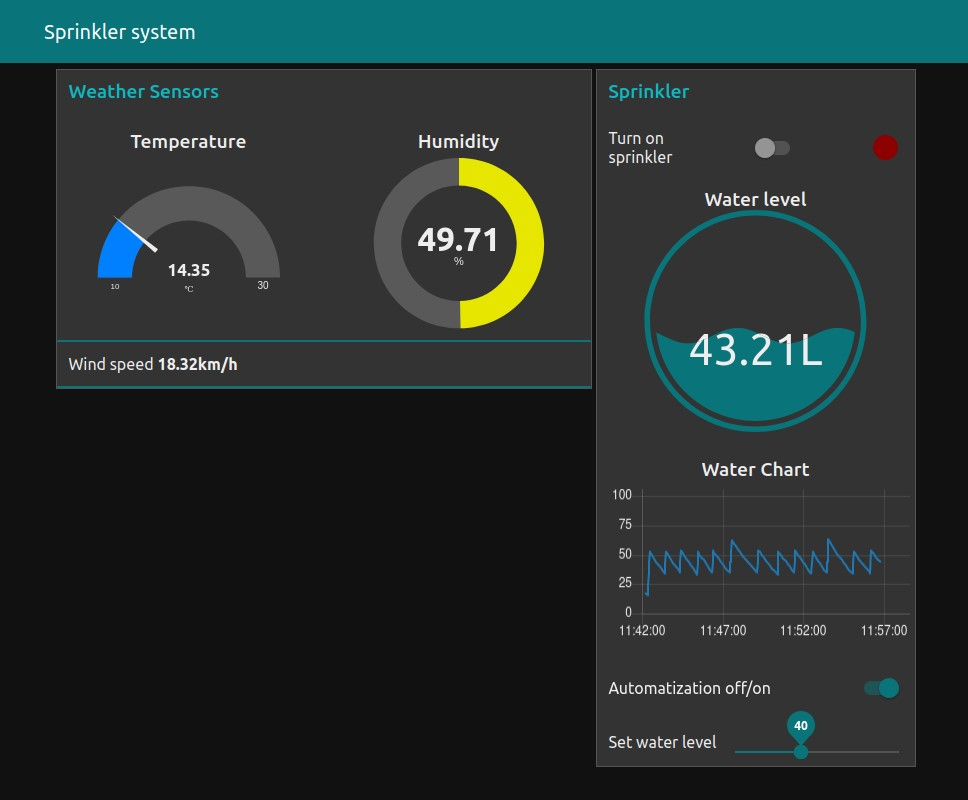

# Irrigation System

## Link to repository:

https://github.com/magdemajt/tir-project-nodered.git

### Project made by: Mateusz Wejman, Mateusz Mazur, Mikołaj Klimek, Karol Wrona

## Overview

This project was made for IoT classes on UST Cracow. The goal of this project was to create software that can be used as a tool for monitoring the humidity of plant soil. The project was designed for small devices like Raspberry pi however, due to technical limitations we used Docker to simulate different parts of the system.

The application is composed of three different components:
- Dirtmodel - mockup of the soil and device with sensors that would measure dirt humidity
- Water Valve - a mockup of a device that would control the flow of the water, integrated into *Dirtmodel*
- MQTT broker - in our case we used mosquito, we use it to communicate between different components
- Node-Red - a programming tool for wiring together software and hardware

Moreover, we implemented a Node-Red dashboard which will display all necessary information to the user and will allow him to control the Water Valve.

### How To Run Application

We provide a Docker Compose container that contains the entire application. To run it make sure that you have Docker Compose installed and type:

```
docker compose up -d
```

To interact with the application proceede to http://localhost:1880/ui

### How to control the application

In dashboard user can turn on and off automatization of watering. If automatization works and water level is below water level set by user on slider, system turn on sprinkler. Watering is turned on, until water level exceed expected value. To avoid too frequent turning sprinkler, water level set by user have 5L margin. If automatization is switched off, user can manually switch on and off watering. When sprinkler is turned off, parameteres are updated onece in 8 seconds. After turned on the watering, user can see changes second by second.  

Inside dashboard view you can monitor the current wheater and the humidity inside the soil. Below the gauge you can see chart that will plot the water level for past 15 minutes (for production release the time interval would be bigger but for the sake of testing we decided to use 15 minute time window). In the top right corner, you will see a switch that will allow user to control the water valve.



## Implementation

### DirtModel

DirtModel was implemented in Python. To better the performance of our application, we used the Python threading library to listen to MQTT messages on another thread.

Our soil model is very advanced, it has real time parameters like humus, looseness, volume and plant water absorption. All of them have an impact on how quickly the water will be evaporating and how much water the plant will absorb. Weather (temperature, air humidity and speed of wind) also influence water absorption.

Dirt model communicates with MQTT broker on topic *"brain"*

### Mqqt protocol

To communicate between different components we use MQQTT Protocol. For the MQQTT broker, we use Mosquitto implementation.

### Node-Red

The rest of the application logic was implemented in the Node-Red flow diagram.


Node red allows user to control the hardware through Node-Red-Dashboard which is plugin to the Node-Red service. The Node-Red server is self hosted and client can interact with it through web application.

### Warning

If you don't see dashboard it might happen that you need to install Node-Red-Dashboard plugin, the best way to do it is to isntall it through Node-Red web app. Please in the top right menu select dropdown menu and select *mannage pallette*, then you can search for *node-red-dashboard* and install it from there. 